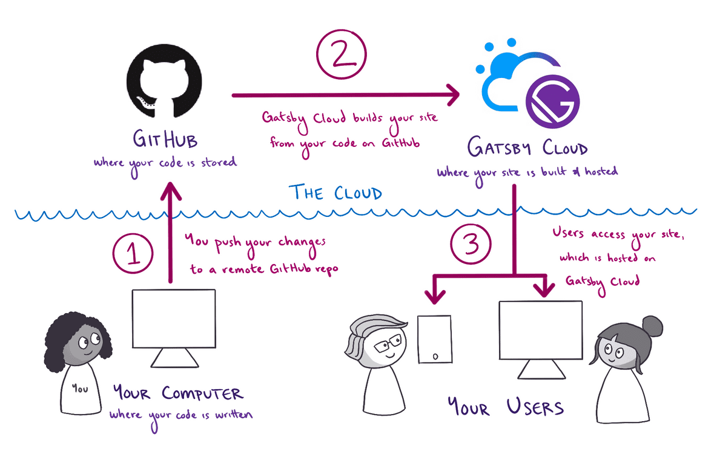

## Gatsby Project를 생성하고, 로컬서버로 구동하기
---

### Gatsby 란?

Gatsby는 간단하게 말해서 정적 사이트 생성기(static site generators)이다. 정적 사이트를 생성하기 위해 React, Graphql, Webpack을 사용하는 하나의 프레임워크로 구성된다.
Gatsby로 생성된 사이트는 템플릿과 컨텐츠(md file)로 분리되어, 빌드하는 시점에서 컨텐츠와 템플릿을 결합하여 HTML 페이지를 생성하고 응답하는 웹서버에 배포한다. 그렇기 때문에 HTML을 제공하는 서버가 필요없게 된다. 이러한 특성은 JAM Stack 아키텍처를 가능하게 만드는데, 이는 더 빠르고 안전한 웹사이트를 구축할 수 있는 장점이 있다.

위 내용을 기반으로 이 블로그는 다음과 같은 흐름을 가지게된다.<br><br>
  1 : gatsby 프로젝트 생성 및 구현<br>
  2 : github에 프로젝트 push<br>
  3 : gatsby cloud와 github 연결 후 build<br>
  4 : 배포<br>




**gatsby 문서**
gatsby doc : https://www.gatsbyjs.com/docs

**참고**
what is gatsby : https://www.mparticle.com/blog/what-is-gatsby
Gatsby 개념 이해하고 튜토리얼 시작하기(김민지님 블로그) : https://velog.io/@mnz/Gatsby-Gatsby-%EA%B0%9C%EB%85%90-%EC%9D%B4%ED%95%B4%ED%95%98%EA%B3%A0-%ED%8A%9C%ED%86%A0%EB%A6%AC%EC%96%BC-%EC%8B%9C%EC%9E%91%ED%95%98%EA%B8%B0

### Gatsby 설치
Gatsby의 명령어 및 기능을 사용하기 위해서 `gatsby-cli`를 전역옵션으로 설치하여야 한다.
```
npm install -g gatsby-cli
```

### Gatsby Project 생성


아래와 같이 `gatsby new` 명령어를 통해 새로운 프로젝트를 생성 할 수 있다.
```
mkdir gatsby   //gatsby 디렉토리 생성
cd gatsby      //gatsby 디렉토리 접근
gatsby new [PROJECT_NAME] [THEME_URL]  //gatsby 프로젝트 생성
```
<br>
아래는 이 블로그를 생성할 때 쓴 내용이다.
```
gatsby new gatsby-bosung-blog https://github.com/gatsbyjs/gatsby-starter-blog
```

템플릿(gatsby-starter-blog) :
https://www.gatsbyjs.com/starters/gatsbyjs/gatsby-starter-blog


### Gatsby Project 로컬 서버 구동

`gatsby new` 명령어로 새로운 gatsby 프로젝트 생성에 성공했다면, 아래의 명령어를 통해 프로젝트 디렉토리에 접근하여 개발서버를 구동할 수 있다.


```
cd gatsby-bosung-blog //프로젝트 디렉토리에 접속
gatsby develop //로컬서버 구동
```
간혹, 공식 gatsby starter 플러그인이 아니거나, 잘못된 플러그인일 경우 이 단계에서 서버구동이 정상적으로 되지 않는다. 다양한 원인과 케이스가 있겠지만, 필자는 node_modules 폴더를 삭제하고 `npm install` 명령어를 통해 재설치하여 문제를 해결한 경험이 있다.

로컬 서버 구동에 성공했다면, 아래와 같은 메시지를 받게 된다.


```
You can now view gatsby-starter-blog in the browser.
⠀
  http://localhost:8000/
⠀
View GraphiQL, an in-browser IDE, to explore your site's data and schema
⠀
  http://localhost:8000/___graphql
```

로컬 서버가 동작중이다. 알려준 주소로 접속하여 확인해보면 성공적으로 동작하는것을 볼 수 있다!

**localhost 접속**


**localhost:8000/__graphql 접속**


